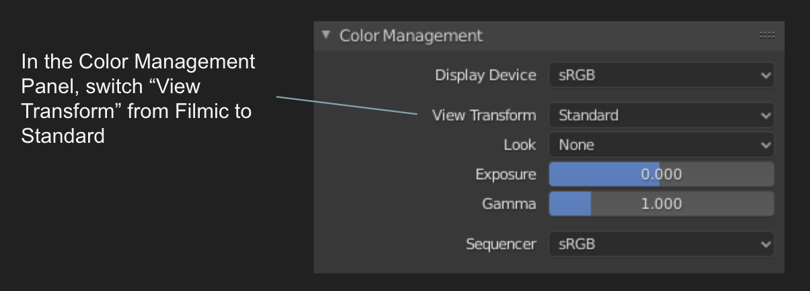
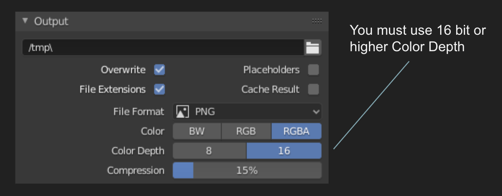
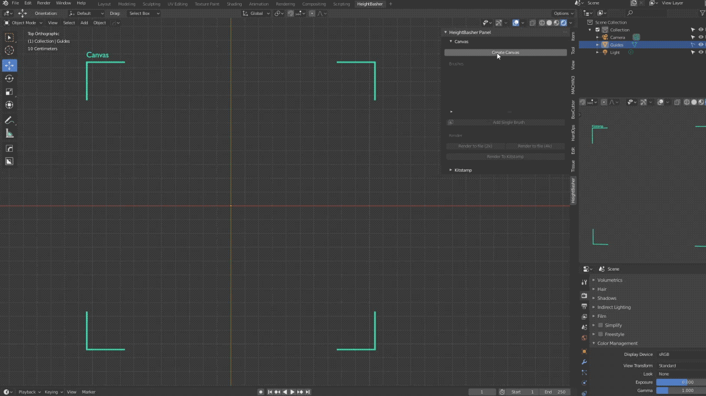
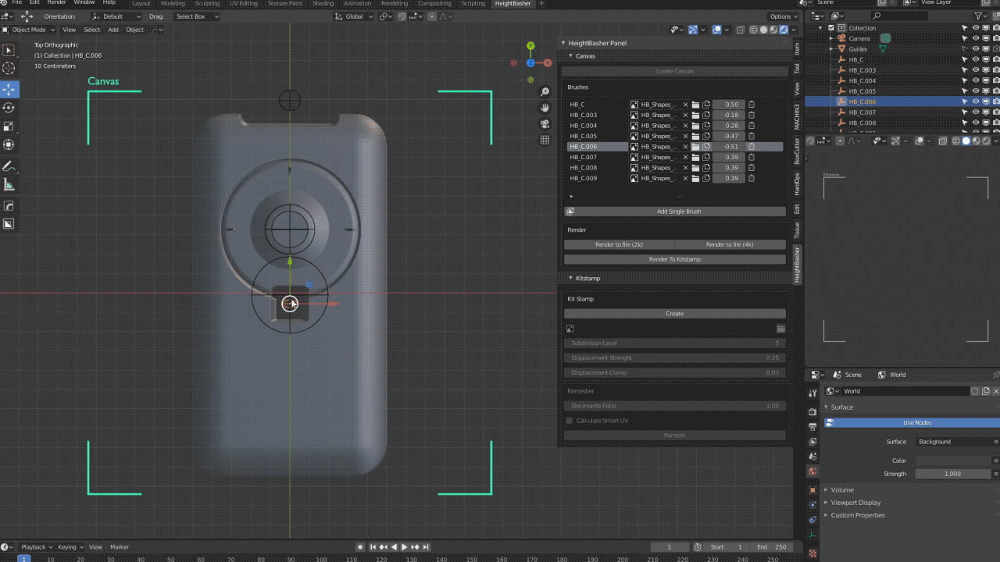
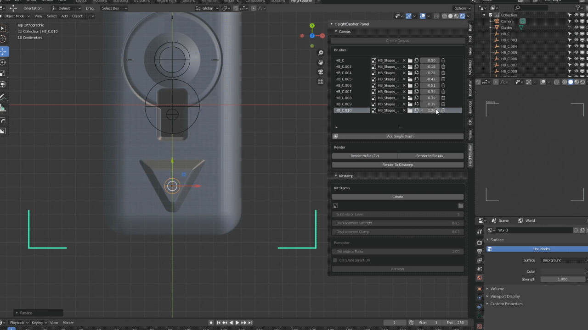
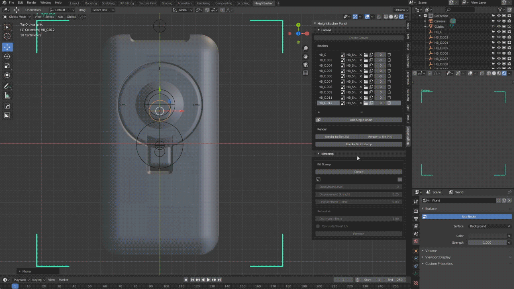
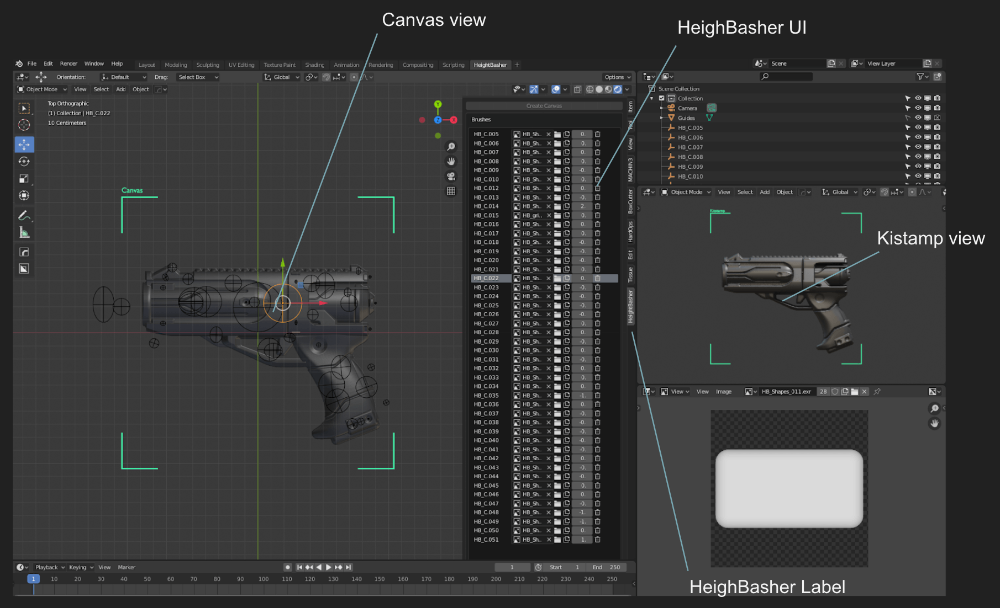

# Getting Started

Before to start, in order to speed up the confidence with Heightbasher we provided an empty blender project that contains an optimized workspace.
Check it out at the end of the page.

---

## Setup the Scene
When working on a brand new project it's important to set some parameter in order to make Heightbasher works correctly

1. In the "Color Management" Panel switch the "View Transform" from "Filmic" to "Standard"
  
  

1. In the "Output" Panel set the "Color Depth" to 16-bit or higher

1. Set the view to Z so you will simulate a 2d environment

---

## Working with Canvas

The first step is to create a canvas where all the brushes will be drawn, this operation will enable all the other operators.

Now you will have to load as many brushes as you want by clicking on on "Add Brush". 
This operation will create an empty object in the center of the canvas, all the empties will be stored in a dedicated Collection in order to keep an ordered workspace.

Each brush is invisible unless you attach a texture to it, you can do it by loading a new texture from the disk or selecting a preloaded texture from the library

Play with the brushes, position, rotation and scale as normals blender object

but you can mix all together by the Factor slider, it's range is from -1 to 1 and it will merge the mix of the brushes in order to add, mix or cut elements

Each brush can be selected by it's empty object both in the scene or UI

When you're ready with the canvas you can choose to render it to a file as a texture (it will open a browser dialog) or to render directly to the kitstamp mesh

---
## Working with Kitstamp

It's a 3d live-rendered object from the canvas (or from a loaded texture).
You can operate on the rendering with these provided operator:

- **Subdivision Level:**  
Sets the previsualization quality of the output
There are 4 levels.
Level 1 and 2 are fast and gives you the opportunity to check your work during the process.
Level 3 and 4 are more intense and needs time to process, we suggest to use it at the end of the workflow for the final renders

- **Displacement Strength:**  
Sets the extrusion level

- **Displacement Clamp:**  
Helps you to keep the scene clean

- **Remesher:**  
Sets the decimation value of the mesh. We also provided the opportunity of automatically calculate the smart uv

---
## Provided Template

Open the addon zip file, extract `HB_Template.blend` and open it.  
We provided this template with 3 areas

- Canvas view: 2d visualization of the brushes
- Heightbasher UI: Panel that permits you to create/destroy/update canvas, brushes, kitstamp and final rendering
- Kitstamp View: live render of your project

