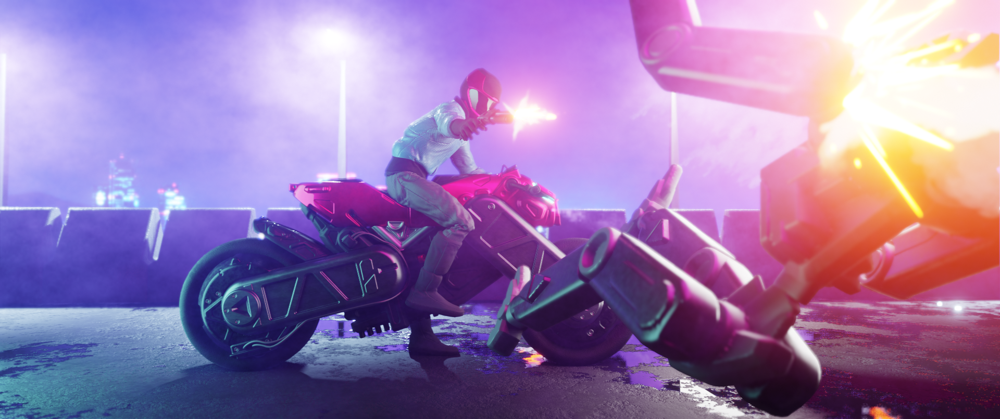
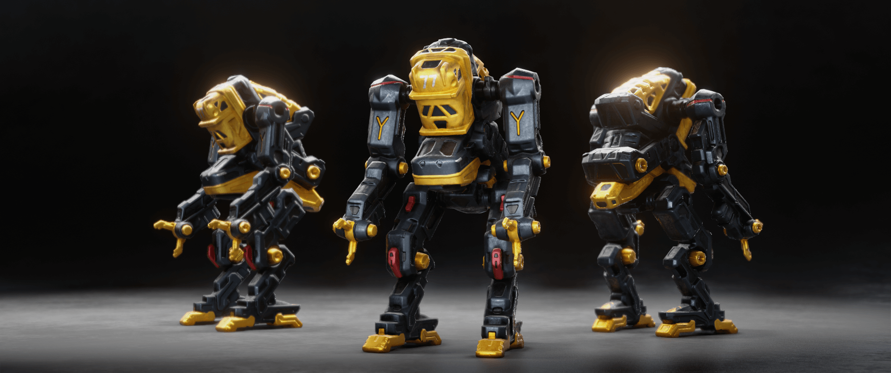
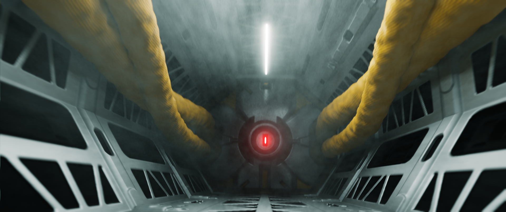
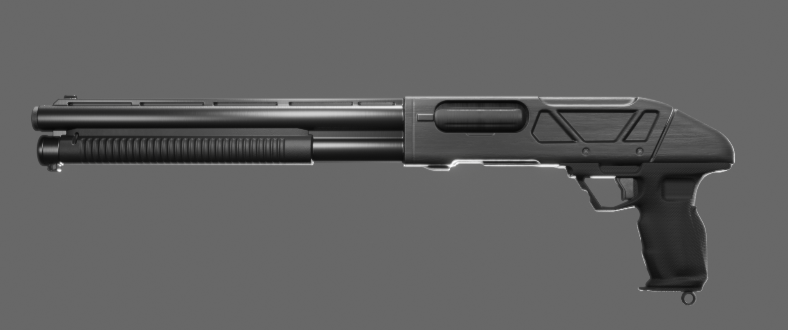
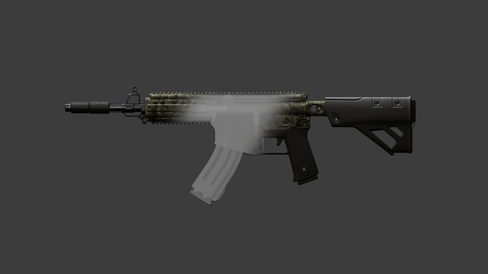

# Heightbasher Documentation

----

Heightbasher is an addon for [Blender 2.8+](https://www.blender.org/), a creative tool dedicated to concept artists that gives you the opportunity to create 3D concepts through a fast and non-destructive workflow thanks to a real-time rendering of multiple heightmaps drawn in a 2d environment

  
  
  

  
  
   
  
  