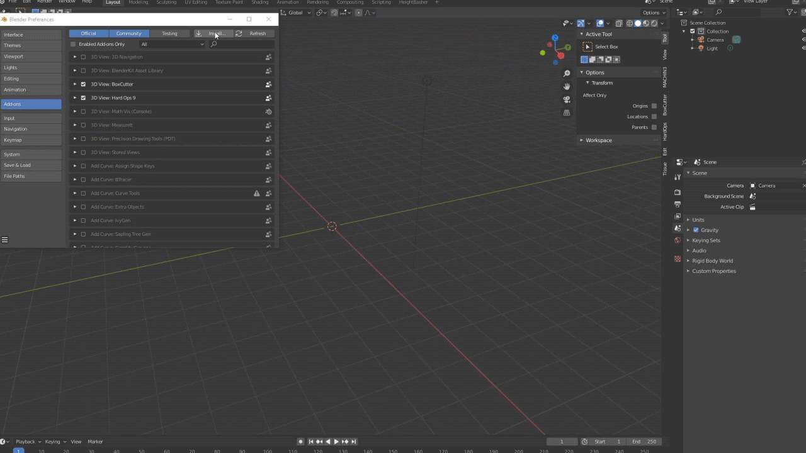

# Installation

## Requirements
[Blender 2.8+](https://www.blender.org/)

---

## Manual Installation

Download Heightbasher from or [Gumroad](https://gumroad.com/VszUb)

##### Windows
Copy the contents of the zip to the addons location:
example:
`C:\Users\YOUR USER\AppData\Roaming\Blender Foundation\Blender\2.8X\scripts\addons`  

##### OSX
Copy the contents of the zip to the addons location:
example:
`/Users/YOUR USER/Library/Application Support/Blender/2.8X/scripts/addons`  

or from the finder menu
"Go" -> "Library"
and then navigate to `Application Support/Blender/2.8X/scripts/addons`  

##### Linux
Copy the contents of the zip to the addons location:
`~/.config/blender/2.8X/scripts/addons`

**Important: Never override the addon !!** 
>If you choose to install a newer version of the package please make sure that you've already uninstalled the previous version by clicking on the "Remove" button inside the addon preference

---

## Install from Blender
Open Blender -> open settings panel  
navigate to "addons", click on "install" and select the zip file you've already downloaded

**Important: Never override the addon !!** 
>If you choose to install a newer version of the package please make sure that you've already uninstalled the previous version by clicking on the "Remove" button inside the addon preference

finally open Blender and enable Heightbasher